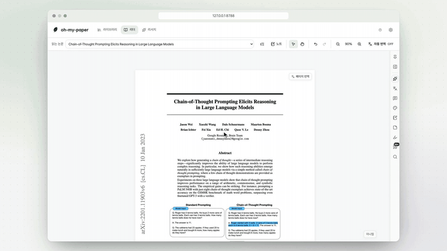
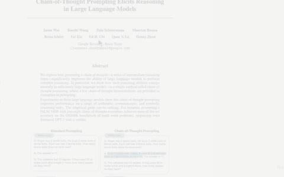
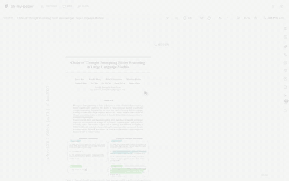
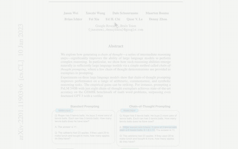
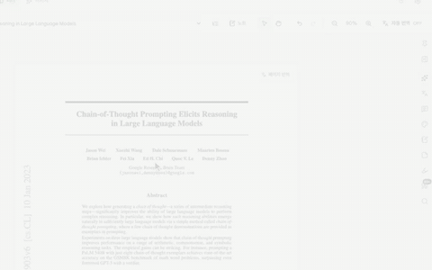
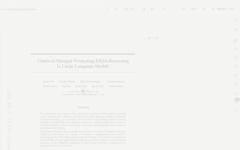

<div align="center">


# oh-my-paper

A local-first reader for research papers.

Select a passage and press a key: its translation, explanation or note appears beside it.<br>
The PDF stays as it is, on your computer.

**English** · [한국어](README.ko.md)

  <a href="LICENSE"></a>

<br>



<sub><a href="docs/media/oh-my-paper-demo.mp4">Full demo (75 s)</a>, recorded from the app</sub>

</div>

> [!NOTE]
> **oh-my-paper is in beta.** It is under active development, so expect rough edges and changes between updates. The interface and AI answers come in Korean or English: the wizard asks which, and `oh-my-paper language` or the app's settings change it.

## Install

```bash
curl -fsSL https://raw.githubusercontent.com/heonyus/oh-my-paper/main/scripts/install.sh | bash
```

You need an Apple Silicon Mac, git and Node.js 22 or later (`brew install node`). A setup wizard follows the install:

1. **Runtime check.** Node.js, plus the ChatGPT sign-in runtime (Codex) and Claude Code used for AI connections.
2. **Document engine.** PaddleOCR-VL (about 3 GB) starts downloading in the background.
3. **AI connection.** A ChatGPT subscription, a Claude subscription or an API key.
4. **Tour.** The keys and first steps, then the app opens.

Papers open and read right away while the engine downloads; each one is analysed once the engine is ready.

## Reading

<table>
<tr>
<td width="50%" valign="top">
<br>
<b>Select, then one key</b><br>
<kbd>T</kbd> translate · <kbd>E</kbd> explain · <kbd>C</kbd> add to notes · <kbd>H</kbd> highlight. The result stays beside the passage as a card.
</td>
<td width="50%" valign="top">
<br>
<b>Whole-page translation</b><br>
A translated page opens beside the original, as the original layout, source, parallel or interleaved text. Click a paragraph to return to it in the PDF.
</td>
</tr>
<tr>
<td width="50%" valign="top">
<br>
<b>Explanations in context</b><br>
Select a hard sentence, a figure or an equation and press <kbd>E</kbd>. The explanation draws on the surrounding text.
</td>
<td width="50%" valign="top">
<br>
<b>Notes in your own words</b><br>
Each sentence you write is matched to the paragraph that supports it. <kbd>C</kbd> brings a passage in with its citation, and <kbd>N</kbd> opens a note card on any screen.
</td>
</tr>
<tr>
<td width="50%" valign="top">
<br>
<b>Overview</b><br>
Keywords, a three-line summary and a full summary, ready when the paper opens. Answers to your questions cite the pages they come from.
</td>
<td width="50%" valign="top">
<br>
<b>Library</b><br>
Drop a PDF in and it opens at once. Title, authors and page structure (figures, tables, equations) are filled in in the background.
</td>
</tr>
</table>

The **?** button in the app plays these clips.

## Principles

- The PDF is never flattened into text. Translations, explanations and notes sit over the original pages.
- Every card and note stays linked to the passage it came from.
- Documents stay on your computer. AI requests go out only when you ask, and only to the provider you connected.
- A ChatGPT or Claude subscription works without an API key.

## AI providers

| Mode | What you need | Default model |
|:--|:--|:--|
| ChatGPT subscription | Your ChatGPT sign-in (in the browser, or a device code) | GPT-6 Luna, when your account offers it |
| Claude subscription | The Claude Code login on this computer; for personal use on your own machine only | Claude Haiku 5.5 |
| API key | A key for OpenRouter, OpenAI, Gemini or Groq | The provider's default |

Models are listed from your account, so new ones appear without an app update. You can switch at any time in the app's AI settings.

## Document engine

Scanned PDFs, figures, tables and equations are read on your computer by PaddleOCR-VL 1.6, accelerated with MLX on Apple Silicon.

- The wizard installs it; progress shows in the app's settings and in `oh-my-paper doctor`.
- It turns itself on when ready, without a restart.
- If it is missing, `oh-my-paper update` and starting the app install it, unless you declined it in the wizard.
- To install it by hand, run `npm run setup:paddle-vl`. It installs [uv](https://docs.astral.sh/uv/) and Python 3.12 as needed.

## Commands

| Command | What it does |
|:--|:--|
| `oh-my-paper` | Start the app and open the browser (the wizard first if no AI is connected) |
| `oh-my-paper onboard` | Run the setup wizard again |
| `oh-my-paper doctor` | Check the runtime, sign-ins, models, engine and data folder |
| `oh-my-paper update` | Update to the latest version and rebuild |
| `oh-my-paper language` | Switch between Korean and English, in the terminal and the app |
| `oh-my-paper start --no-open` | Start without opening a browser |

The app runs at `http://127.0.0.1:8788` and keeps its data in `~/.ohmypaper`.

## Privacy

| What | Where |
|:--|:--|
| PDFs, library, notes, highlights and cards | Your computer |
| Page analysis (PDF.js and PaddleOCR-VL) | Your computer |
| Translation, explanation and summary requests | The AI provider you connected, only when you ask |

Opening a PDF sends it nowhere. API keys are stored encrypted and go only to the provider they belong to. Subscriptions and APIs have their own costs and limits.

## Development

<details>
<summary>Run from source</summary>

Requires Node.js 22+ and npm, on macOS or Windows.

```bash
git clone https://github.com/heonyus/oh-my-paper.git
cd oh-my-paper
npm ci
npm run build:web
npm run cli          # same as the oh-my-paper command
```

`npm run start:web` also starts the app and `npm run setup` reruns the wizard. Optional local runtimes:

```bash
npm run setup:paddle-vl   # PaddleOCR-VL, plus an MLX-VLM server on Apple Silicon
npm run setup:layout
npm run setup:mineru
```

</details>

<details>
<summary>GPU acceleration on Windows with NVIDIA</summary>

`npm run setup:paddle-vl` also installs a vLLM server inside WSL (an Ubuntu distribution with uv); `npm run setup:paddle-vllm` reinstalls just that part. It takes about 13 GB inside WSL and about 4.6 GB of GPU memory during analysis, and recognizes a page in about 2 seconds on an RTX 3060 Ti. The app starts the server when needed and stops it after ten idle minutes.

</details>

<details>
<summary>Desktop app (Electron)</summary>

```bash
npm run build
npm run dev
```

Rebuild after changing the main or preload code. Account setup for the desktop app is described in [docs/account-service.md](docs/account-service.md).

</details>

<details>
<summary>Checks and contributing</summary>

```bash
npm run verify
npm run build
```

Please read [CONTRIBUTING.md](CONTRIBUTING.md) before opening a pull request, and report security issues privately as described in [SECURITY.md](SECURITY.md).

</details>

## Status

oh-my-paper is in beta and supports Apple Silicon Macs. Packaging, code signing and the oldest supported macOS version are not settled yet; see [release readiness](docs/release-readiness.md) and [Mac packaging](docs/mac-release.md).

Contributions are welcome, especially reproducible synthetic PDF fixtures, local parser improvements, accessibility fixes and packaging checks.

---

<sub>[MIT](LICENSE) · Demo paper: Wei et al., "Chain-of-Thought Prompting Elicits Reasoning in Large Language Models", [arXiv:2201.11903](https://arxiv.org/abs/2201.11903), CC BY 4.0</sub>
